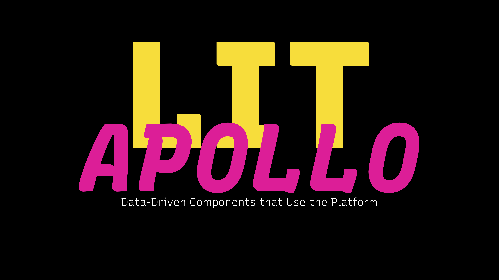

# Using `lit-apollo`

A slide deck on GraphQL and Web Components

## Uses

- [slidem](https://github.com/ruphin/slidem)
- [zero-md](https://github.com/zerodevx/zero-md)
- [json-viewer](https://github.com/bennypowers/json-viewer)
- [service-worker](https://github.com/bennypowers/service-worker)
- [rollup](https://rollupjs.org)
- [workbox](https://developers.google.com/web/tools/workbox/)